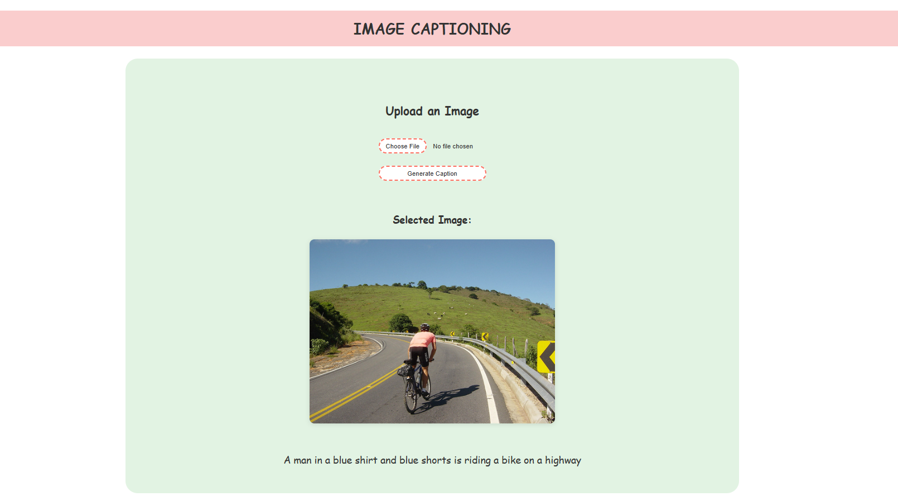

# Image Captioning

An end-to-end deep learning project that generates descriptive captions for images using encoder-decoder architecture with ResNet50 and transformer-based models.

## Overview

This project implements an image captioning system that automatically generates natural language descriptions for images. It uses a CNN encoder (ResNet50) to extract visual features and a transformer decoder to generate captions.

## Project Structure

```
img-captioning/
├── application.py                # Flask HTML web app entry (serves templates/index.html)
├── templates/                    # HTML templates for the Flask app
│   └── index.html
├── src/                          # Core source code
│   ├── base_model.py             # Encoder and decoder model architectures
│   ├── custom_dataset.py         # PyTorch Dataset class
│   ├── data_ingestion.py         # Download and process raw data from Kaggle
│   ├── inference.py              # Inference / caption generation utilities
│   ├── train.py                  # Model training loop and utilities
│   ├── custom_exception.py       # Custom exception handling
│   ├── logger.py                 # Logging configuration
│   └── __init__.py
│
├── config/                       # Configuration files
│   ├── data_ingestion_config.py  # Data paths and parameters
│   ├── model_config.py           # Model hyperparameters
│   └── __init__.py
│
├── pipeline/                     # Data processing & orchestration
│   ├── main.py                   # Full pipeline entrypoint: ingestion → preprocessing → dataloaders → training/evaluation
│   └── processing.py             # Data preprocessing and augmentation functions
│
├── utils/                        # Utility functions
│   ├── common_functions.py       # Helper functions
│   └── __init__.py
│
├── artifacts/                    # Generated outputs
│   ├── raw/                      # Raw dataset (images & captions)
│   │   ├── Images/               # Image files
│   │   └── captions.txt          # Captions text file
│   └── dataloaders/              # Serialized PyTorch data loaders
│       ├── train.pt              # Training data loader
│       ├── valid.pt              # Validation data loader
│       └── test.pt               # Test data loader
│
├── logs/                         # Application logs
├── NoteBook.ipynb                # Jupyter notebook for experimentation
├── setup.py                      # Package setup configuration
├── requirements.txt              # Python dependencies
└── README.md                     # This file
```

## Web App

A lightweight HTML Flask application serves the user interface. The Flask app (application.py) renders templates/index.html, accepts image uploads, runs the model inference pipeline, and returns captions to the page. Run locally with:
```bash
python application.py
```
(the app listens on 0.0.0.0:5000 by default in development).

Here is Web app's screenshot👇



## Pipeline

The pipeline/main.py file is the project's orchestration entrypoint. It ties together:
- data ingestion (download and verify datasets),
- preprocessing and augmentation (pipeline/processing.py),
- dataset and dataloader creation (src/custom_dataset.py),
- model training, evaluation, and serialization.

Run the entire pipeline locally with:
```bash
python pipeline/main.py
```

## Installation & Usage

1. Clone the repository:
```bash
git clone <repo-url>
cd img-captioning
```
2. Create and activate virtual environment:
```bash
python -m venv venv
venv\Scripts\activate  # On Windows
source venv/bin/activate  # On Linux/Mac
```
3. Install dependencies:
```bash
pip install -e .
```

## Dependencies

- torch
- torchvision
- transformers
- kagglehub
- Pillow
- numpy
